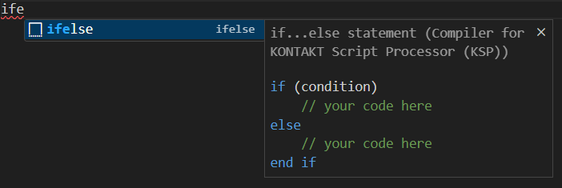
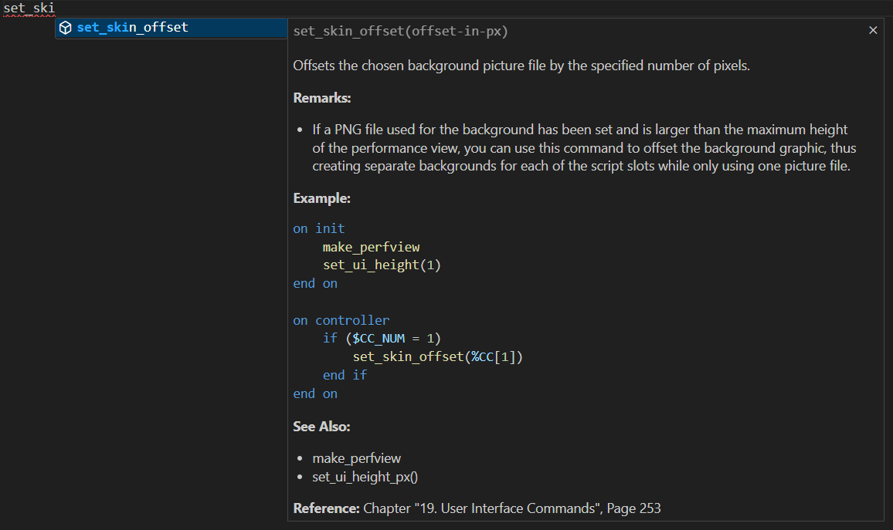
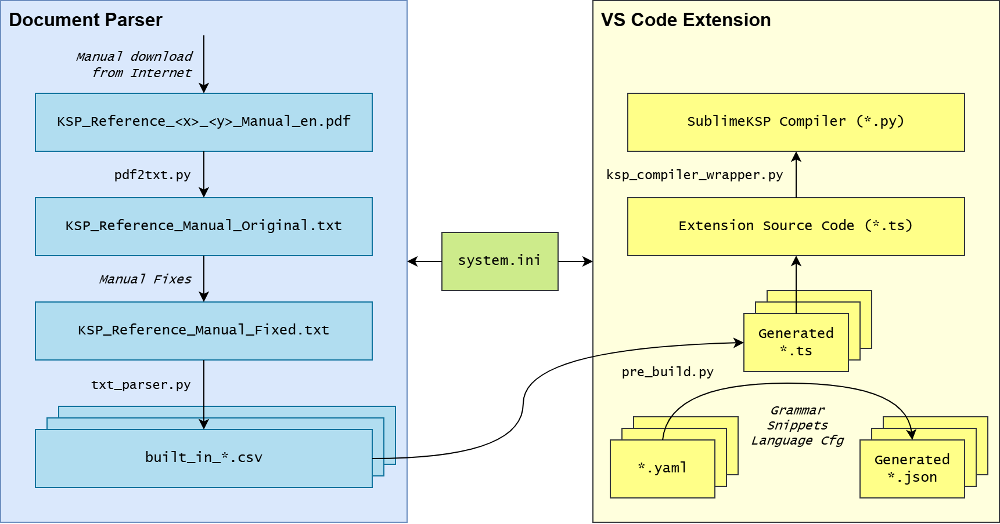

# vscode-ksp-compiler
Visual Studio Code Extension for compiling NI KONTAKT(TM) Script Processor (KSP) scripts

## Features
### Compiler
Press F7 to compile the KSP script and copy it to clipboard:  
  
Note: The [SublimeKSP Compiler CLI](https://github.com/nojanath/SublimeKSP) is used here which is integrated as submodule at `vscode_extension/sublime_ksp`

### Syntax Check
On the fly syntax checking using the KSP Compiler:  
  
   
### Syntax Highlighting
Syntax Highlighting including the extended syntax of the KSP Compiler:  

### Outline View
Outline view of callbacks, functions and variables:  

### Snippets
Snippets for basic control statements, built-in callbacks, widgets, functions, commands:  

### Autocompletion
Autocompletion for built-in callbacks, widgets, functions, commands, and variables:  

### Documentation
Documentation on mouse hover:  

### Find References/Definition
Find References and Go to Definition:  

## Architecture
### Overview

### Configuration
* For each KSP version a system configuration file must be created at `cfg/<ksp_version>/system.ini`.
* This is used by the [Document Parser](#document-parser) and by the [Visual Studio Code Extension](#visual-studio-code-extension).

### Document Parser
The Python scripts for parsing the documentation are located at `doc_parser/bin`:
* **[pdf2txt.py](doc_parser/bin/pdf2txt.py):** Converts the KSP manual (\*.pdf) provided by Native Instruments to a
  text file (\*.txt). Note that the generated text file requires manual fixes before parsing.
* **[txt_parser.py](doc_parser/bin/txt_parser.py):** Parses the manually fixed text file (\*.txt) and generates \*.csv
  files for built-in callbacks, widgets, functions, commands, and variables as input for the VS Code Extension.

For details check [doc_parser README.md](doc_parser/REAMDE.md).

### Visual Studio Code Extension
The VS Code extension is located at `vscode_extension` and have some Python helper scripts at `vscode_extension/bin`:
* **[pre_build.py](vscode_extension/bin/pre_build.py):** This script is called before the VS Code Extension build
  process. Based on the \*.csv files provided by the [Document Parser](#document-parser) it performs the following steps:
  * Converts some \*.yaml files to \*.json required by the VS Code Language Extension (Grammar, Snippets, Language
    Configuration)
  * Reads the \*.csv files provided by the Document Parser and generates TypeScript (\*.ts) files for the VS Code
    Extension at `vscode_extension/src/generated`
  * Inject names read from the \*.csv files into the grammar JSON file
  * Inject callbacks and widgets read from the \*.csv files into the snippets JSON file
* **[ksp_compiler_wrapper.py](vscode_extension/bin/ksp_compiler_wrapper.py):** This script is called from within the VS
  Code Extension to compile a KSP script and to extract the error messages from the KSP Compiler.

## References
This project
* integrates the [SublimeKSP Compiler](https://github.com/nojanath/SublimeKSP) by [Jonathan Thompson](https://github.com/nojanath)
  which was forked from [Nils Liberg's official SublimeKSP plugin, v1.11](http://nilsliberg.se/ksp/) released under the [GPL v3.0 license](https://github.com/nojanath/SublimeKSP/blob/master/LICENSE)
* is highly inspired by the [Visual Studio Code Extension for NI KONTAKT Script Processor (KSP)](https://github.com/r-koubou/vscode-ksp) by
  [Hiroaki@R-Koubou](https://github.com/r-koubou) released under the [MIT license](https://github.com/r-koubou/vscode-ksp/blob/main/LICENSE)

## License
[GPL v3.0](LICENSE)

## Author
[MooseFriend](https://github.com/moosefriend)