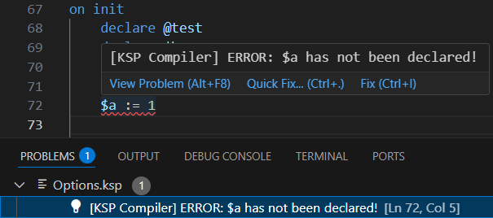
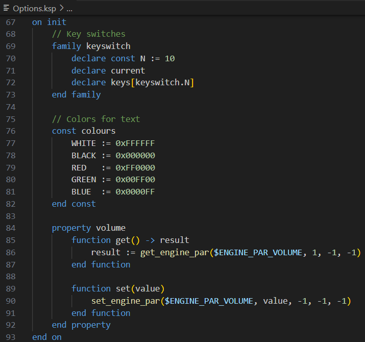
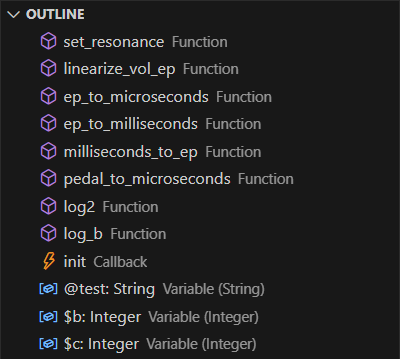
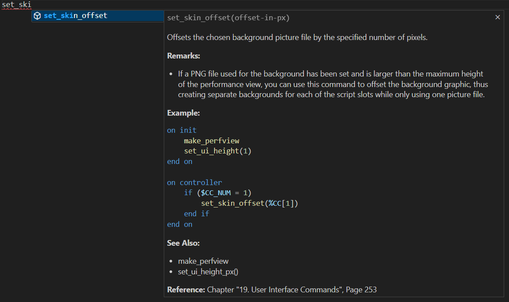

# vscode-ksp-compiler

Visual Studio Code Extension for compiling NI KONTAKT(TM) Script Processor (KSP) scripts

## Features

### Compiler

Press F7 to compile the KSP script and copy it to clipboard:  
  
Note: The [SublimeKSP Compiler CLI](https://github.com/nojanath/SublimeKSP) is used here which is integrated as submodule at `vscode_extension/sublime_ksp`

### Syntax Check

On the fly syntax checking using the KSP Compiler:  

### Syntax Highlighting

Syntax Highlighting including the extended syntax of the KSP Compiler:  

### Outline View

Outline view of callbacks, functions and variables:  

### Snippets

Snippets for basic control statements, built-in callbacks, widgets, functions, commands:  

### Autocompletion

Autocompletion for built-in callbacks, widgets, functions, commands, and variables:  

### Documentation

Documentation on mouse hover:  

### Find References/Definition

Find References and Go to Definition:  

## References

This project

* integrates the [SublimeKSP Compiler](https://github.com/nojanath/SublimeKSP) by [Jonathan Thompson](https://github.com/nojanath)
  which was forked from [Nils Liberg's official SublimeKSP plugin, v1.11](http://nilsliberg.se/ksp/) released under the [GPL v3.0 license](https://github.com/nojanath/SublimeKSP/blob/master/LICENSE)
* is highly inspired by the [Visual Studio Code Extension for NI KONTAKT Script Processor (KSP)](https://github.com/r-koubou/vscode-ksp) by
  [Hiroaki@R-Koubou](https://github.com/r-koubou) released under the [MIT license](https://github.com/r-koubou/vscode-ksp/blob/main/LICENSE)

## License

[GPL v3.0](LICENSE)

## Author

[MooseFriend](https://github.com/moosefriend)
